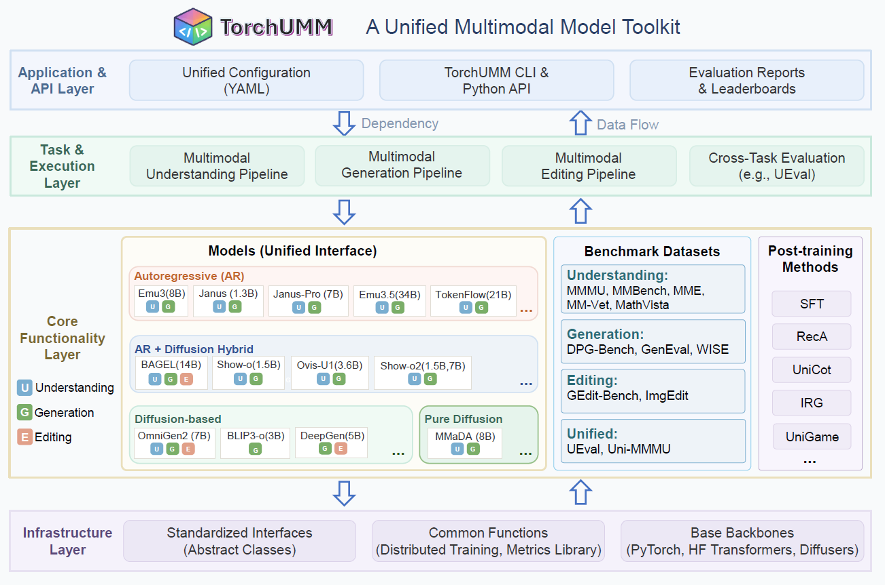

<p align="center">
  
</p>

<h3 align="center">TorchUMM: Unified Multimodal Model Toolkit</h3>

<p align="center">
  A unified framework for unified multimodal model inference, evaluation, and post-training.
</p>

<p align="center">
  <a href="https://www.python.org/downloads/"></a>

</p>

---

## Table of Contents

- [Table of Contents](#table-of-contents)
- [Introduction](#introduction)
- [Supported Models](#supported-models)
- [Repository Structure](#repository-structure)
- [Installation](#installation)
- [Data Preparation](#data-preparation)
  - [Understanding Benchmarks Data](#understanding-benchmarks-data)
  - [Generation Benchmarks Data](#generation-benchmarks-data)
  - [Other Benchmarks Data](#other-benchmarks-data)
- [Usage](#usage)
  - [Local Execution (CLI)](#local-execution-cli)
  - [AMD HPC Execution](#amd-hpc-execution)
  - [Python API](#python-api)
- [Evaluation Results](#evaluation-results)
  - [Generation Benchmarks](#generation-benchmarks)
  - [Understanding Benchmarks](#understanding-benchmarks)
  - [Editing Benchmarks](#editing-benchmarks)
    - [GEdit-Bench](#gedit-bench)
    - [ImgEdit-Bench](#imgedit-bench)
  - [Uni-MMMU Benchmark](#uni-mmmu-benchmark)
  - [Post-Training Models](#post-training-models)
  - [Detailed Sub-scores](#detailed-sub-scores)
  - [Reproducing Results](#reproducing-results)
- [Extending TorchUMM](#extending-torchumm)
  - [Adding a New Model](#adding-a-new-model)
  - [Adding a New Benchmark](#adding-a-new-benchmark)
  - [Adding a New Post-Training Method](#adding-a-new-post-training-method)
- [Post-Training Methods](#post-training-methods)
- [Disclaimers](#disclaimers)
- [Citation](#citation)

---

## Introduction

**TorchUMM** is a unified toolkit for running, evaluating, and fine-tuning state-of-the-art multimodal models under a single interface. It is designed to make fair, reproducible comparisons across diverse multimodal architectures easy.

**Key features:**

- **Pluggable backbone architecture** — 14 multimodal model adapters with a unified inference interface
- **Comprehensive evaluation** — 10+ benchmarks covering generation, understanding, and editing
- **Post-training support** — SFT, IRG, recA, UniCot, Unigame
- **Cloud-native** — seamless scaling to cloud GPUs via [Modal](https://modal.com) ([details](modal/README.md))
- **Config-driven** — all behavior controlled through YAML configs; no code changes needed to switch models or benchmarks

---

## Supported Models

| Model                                               | Parameters | Understand | Generate | Edit |              Docs              |
| :-------------------------------------------------- | :--------: | :--------: | :------: | :--: | :----------------------------: |
| [Bagel](https://github.com/jpthu17/Bagel)              |    7B     |     ✅     |    ✅    |  ✅  |   [guide](docs/models/bagel.md)   |
| [DeepGen](https://github.com/deepgenteam/DeepGen)      |    5B     |     ❌     |    ✅    |  ✅  | [guide](docs/models/deepgen.md)  |
| [OmniGen2](https://github.com/VectorSpaceLab/OmniGen2) |    7B     |     ✅     |    ✅    |  ✅  | [guide](docs/models/omnigen2.md) |
| [Emu3](https://github.com/baaivision/Emu3)             |    8B     |     ✅     |    ✅    |  ❌  |   [guide](docs/models/emu3.md)   |
| [Emu3.5](https://github.com/baaivision/Emu3.5)         |    34B    |     ✅     |    ✅    |  ✅  |  [guide](docs/models/emu3_5.md)  |
| [MMaDA](https://github.com/Gen-Verse/MMaDA)                    |    8B     |     ✅     |    ✅    |  ❌  |  [guide](docs/models/mmada.md)    |
| [Janus](https://github.com/deepseek-ai/Janus)              |   1.3B    |     ✅     |    ✅    |  ❌  |  [guide](docs/models/janus.md)     |
| [Janus-Pro](https://github.com/deepseek-ai/Janus)          |  1B, 7B   |     ✅     |    ✅    |  ❌  | [guide](docs/models/janus_pro.md)  |
| [JanusFlow](https://github.com/deepseek-ai/Janus)          |   1.3B    |     ✅     |    ✅    |  ❌  | [guide](docs/models/janus_flow.md) |
| [Show-o](https://github.com/showlab/Show-o)             |   1.3B    |     ✅     |    ✅    |  ❌  |  [guide](docs/models/show_o.md)   |
| [Show-o2](https://github.com/showlab/Show-o)           | 1.5B, 7B  |     ✅     |    ✅    |  ❌  |  [guide](docs/models/show_o2.md)  |
| [BLIP3-o](https://github.com/salesforce/BLIP3o)        |    4B     |     ❌     |    ✅    |  ❌  |  [guide](docs/models/blip3o.md)  |
| [TokenFlow](https://github.com/ByteFlow-AI/TokenFlow)  |          |     ❌     |    ✅    |  ❌  | [guide](docs/models/tokenflow.md) |
| [Ovis-U1](https://github.com/AIDC-AI/Ovis-U1)         |    3B     |     ✅     |    ✅    |  ✅  | [guide](docs/models/ovis_u1.md)  |

> See each model's [guide](docs/models/) for detailed usage instructions, configuration examples, and supported benchmarks.
>
> **Emu3.5 note:** Emu3.5 is the only model in TorchUMM that uses **native vLLM integration** via BAAI's official patches (20 patches applied at image build time). Unlike other models that use the standard `TransformersForCausalLM` wrapper, Emu3.5 runs on vLLM's optimized attention kernels with a custom batch scheduler for classifier-free guidance, achieving ~74 tokens/s on 2×A100-80GB. See the [Emu3.5 guide](docs/models/emu3_5.md) for details.
>
> **Flash Attention note:** Most models require or benefit from [Flash Attention](https://github.com/Dao-AILab/flash-attention). **Do not** `pip install flash-attn` from source (extremely slow, error-prone). Instead, download a pre-compiled wheel from [flash-attention releases](https://github.com/Dao-AILab/flash-attention/releases) matching your Python/CUDA/PyTorch/ABI. All Modal images already include the correct wheel. See each model's guide for the exact wheel command:
>
> | Model | flash-attn | Status | Guide |
> |---|---|---|---|
> | Bagel | 2.5.8 | Required | [guide](docs/models/bagel.md#flash-attention-required) |
> | BLIP3-o | 2.6.2 | Required | [guide](docs/models/blip3o.md#flash-attention-required) |
> | Emu3 | 2.5.7 | Required | [guide](docs/models/emu3.md#flash-attention-required) |
> | Emu3.5 | 2.8.3 | Required | [guide](docs/models/emu3_5.md#flash-attention-required) |
> | Janus-Pro | 2.7.4 | Required | [guide](docs/models/janus_pro.md#flash-attention-required) |
> | MMaDA | 2.7.4 | Recommended | [guide](docs/models/mmada.md#flash-attention-recommended) |
> | Show-o2 | 2.7.4 | Required | [guide](docs/models/show_o2.md#flash-attention-required) |
> | OmniGen2 | 2.7.4 | Recommended | [guide](docs/models/omnigen2.md#flash-attention-recommended) |
> | DeepGen | latest | Recommended | [guide](docs/models/deepgen.md#flash-attention-recommended) |

---

## Repository Structure
<p align="center">
  
</p>

```
umm_codebase/
├── src/umm/                    # Core framework
│   ├── backbones/              # Model adapters (Bagel, BLIP3-o, DeepGen, Emu3, Emu3.5, Janus, Janus-Pro, JanusFlow, MMaDA, OmniGen2, Show-o, Show-o2, TokenFlow)
│   ├── cli/                    # CLI entry points (infer, eval, train)
│   ├── core/                   # Config, registry, interfaces
│   ├── data/                   # Datasets, collators, transforms
│   ├── evaluation/             # Evaluation runners and metrics
│   ├── inference/              # Inference pipeline (batching, generation)
│   ├── models/                 # Model builders, heads, processors
│   ├── post_training/          # Post-training methods (SFT, IRG, recA, UniCot)
│   └── serving/                # Serving APIs
│
├── model/                      # External model repos & evaluation toolkits (submodules)
│   ├── Bagel/, BLIP3o/, deepgen/, Emu3/, Emu3.5/, MMaDA/, OmniGen2/, Show-o/, TokenFlow/
│   └── UEval/, Uni-MMMU/, WISE/, geneval/, Step1X-Edit/
│
├── configs/                    # YAML configurations
│   ├── inference/              # Per-model inference configs
│   ├── eval/                   # Benchmark evaluation configs (modal_*, amd_*, and local)
│   └── posttrain/              # Post-training configs
│
├── modal/                      # Modal cloud infrastructure (see modal/README.md)
├── docs/                       # Per-model usage documentation
├── eval/                       # Evaluation runner scripts
├── scripts/                    # Utility scripts
└── output/                     # Evaluation results
```

---

## Installation

```bash
# Clone the repository
git clone --recursive https://github.com/AIFrontierLab/TorchUMM.git
cd TorchUMM

# Install the package
pip install -e .

# Install model-specific dependencies (example: Bagel)
pip install -r model/Bagel/requirements.txt
```

> **Note:** Each backbone model has its own dependencies and may require different Python/PyTorch versions. Install only the requirements for the model(s) you plan to use. For cloud execution via [Modal](https://modal.com), each model runs in an isolated container image with the correct environment — see [modal/README.md](modal/README.md) for details.

---

### Understanding Benchmarks Data

Understanding benchmarks data is prepared following the [InternVL evaluation data preparation](https://internvl.readthedocs.io/en/latest/get_started/eval_data_preparation.html) guide. All data is stored under `data/` at the repository root. Below is a quick-start summary — see [eval/vlm/README.md](eval/vlm/README.md) for full details.

**MME**

```bash
mkdir -p data/mme
cd data/mme
wget https://huggingface.co/OpenGVLab/InternVL/resolve/main/MME_Benchmark_release_version.zip
unzip MME_Benchmark_release_version.zip
cd -
```

**MMBench**

```bash
mkdir -p data/mmbench
cd data/mmbench
wget https://download.openmmlab.com/mmclassification/datasets/mmbench/mmbench_dev_20230712.tsv
wget https://download.openmmlab.com/mmclassification/datasets/mmbench/mmbench_dev_cn_20231003.tsv
wget https://download.openmmlab.com/mmclassification/datasets/mmbench/mmbench_dev_en_20231003.tsv
wget https://download.openmmlab.com/mmclassification/datasets/mmbench/mmbench_test_cn_20231003.tsv
wget https://download.openmmlab.com/mmclassification/datasets/mmbench/mmbench_test_en_20231003.tsv
cd -
```

**MM-Vet**

```bash
mkdir -p data/mm-vet
cd data/mm-vet
wget https://github.com/yuweihao/MM-Vet/releases/download/v1/mm-vet.zip
unzip mm-vet.zip
wget https://huggingface.co/OpenGVLab/InternVL/raw/main/llava-mm-vet.jsonl
cd -
```

**MathVista**

```bash
mkdir -p data/MathVista
cd data/MathVista
wget https://huggingface.co/datasets/AI4Math/MathVista/raw/main/annot_testmini.json
cd -
```

**MMMU** — auto-downloaded from HuggingFace (`MMMU/MMMU`) at evaluation time, cached in `data/MMMU/`. No manual download needed.

### Generation Benchmarks Data

These benchmarks include their data in the repository:

- **DPG Bench**: Prompts in `eval/generation/dpg_bench/prompts/` (100 prompt files)
- **GenEval**: Metadata and prompts in `model/geneval/`
- **WISE**: Benchmark data in `model/WISE/`

### Other Benchmarks Data

- **UEval**: Auto-downloaded from HuggingFace (`primerL/UEval-all`) at evaluation time. For Modal, run `modal run modal/download.py --dataset ueval`.
- **Uni-MMMU**: Requires dataset, scoring models (Qwen2.5-VL-72B-Instruct + Qwen3-32B), and DreamSim (auto-downloaded). For Modal: `modal run modal/download.py --dataset uni_mmmu` and `modal run modal/download.py --model evaluator`. See [eval/generation/uni_mmmu/README.md](eval/generation/uni_mmmu/README.md) for full setup.
- **GEdit-Bench**: Auto-downloaded from HuggingFace (`stepfun-ai/GEdit-Bench`) at evaluation time. For Modal, run `modal run modal/download.py --dataset gedit`. Scoring uses Qwen2.5-VL-72B-Instruct (same as WISE).

---

## Usage

### Local Execution (CLI)

**Inference**

```bash
PYTHONPATH=src python -m umm.cli.main infer --config configs/inference/modal_bagel_generation.yaml
```

**Evaluation**

```bash
# DPG Bench on Bagel
PYTHONPATH=src python -m umm.cli.main eval --config configs/eval/dpg_bench/dpg_bench_bagel.yaml

# GenEval on Bagel (full pipeline: generation + scoring)
PYTHONPATH=src python -m umm.cli.main eval --config configs/eval/geneval/geneval_bagel.yaml

# UEval on Bagel
PYTHONPATH=src python -m umm.cli.main eval --config configs/eval/ueval/ueval_bagel.yaml

# MME on Bagel
PYTHONPATH=src python -m umm.cli.main eval --config configs/eval/mme/mme_bagel.yaml
```

**Post-Training**

```bash
PYTHONPATH=src python -m umm.cli.main train --config configs/posttrain/bagel_sft.yaml
```

> For cloud GPU execution via [Modal](https://modal.com), see [modal/README.md](modal/README.md).

### AMD HPC Execution

For AMD ROCm clusters, use `amd_` prefixed configs which contain AMD HPC absolute paths:

```bash
# Using local_run.sh (recommended)
bash scripts/amd_migration/local_run.sh bagel --eval-config amd_ueval_bagel

# Or directly with CLI
PYTHONPATH=src python -m umm.cli.main eval --config configs/eval/ueval/amd_ueval_bagel.yaml
```

Config naming convention:
- `modal_*.yaml` — Modal cloud (container mount paths like `/model_cache/...`)
- `amd_*.yaml` — AMD HPC (absolute paths like `/work1/jwang/yinyil/model_cache/...`)
- `*.yaml` (no prefix) — Legacy local configs (may have outdated paths)

> To regenerate AMD configs after modifying modal configs: `python scripts/generate_amd_configs.py`

**Upload Outputs to HuggingFace**

Evaluation outputs live on Modal's `umm-outputs` Volume. To upload them to HuggingFace (directly from Modal, no local download):

```bash
# Upload everything (resumable — re-run if interrupted)
modal run modal/upload_outputs.py --repo-id wenwenw945/umm_outputs

# Upload a specific subdirectory only
modal run modal/upload_outputs.py --repo-id wenwenw945/umm_outputs --subdir geneval

# Force overwrite: clear remote first, then upload
modal run modal/upload_outputs.py --clear --repo-id wenwenw945/umm_outputs
modal run modal/upload_outputs.py --repo-id wenwenw945/umm_outputs

# Dry run — list what would be uploaded
modal run modal/upload_outputs.py --repo-id wenwenw945/umm_outputs --dry-run
```

> Requires a `huggingface-secret` Modal secret with your `HF_TOKEN`.

### Python API

You can also use TorchUMM programmatically:

```python
from umm.inference.pipeline import InferencePipeline
from umm.inference.multimodal_inputs import InferenceRequest

# Initialize the pipeline with a backbone model
pipeline = InferencePipeline(
    backbone_name="bagel",
    backbone_cfg={
        "model_path": "/path/to/BAGEL-7B-MoT",
        "max_mem_per_gpu": "80GiB",
        "seed": 42,
    },
)

# Text-to-image generation
result = pipeline.run(InferenceRequest(
    backbone="bagel",
    task="generation",
    prompt="A cat sitting on a rainbow",
    params={"num_timesteps": 50},
))

# Image understanding
result = pipeline.run(InferenceRequest(
    backbone="bagel",
    task="understanding",
    prompt="Describe this image in detail.",
    images=["path/to/image.jpg"],
    params={"max_think_token_n": 500, "do_sample": False},
))

# Image editing
result = pipeline.run(InferenceRequest(
    backbone="bagel",
    task="editing",
    prompt="Make the sky purple",
    images=["path/to/image.jpg"],
    params={"num_timesteps": 25},
))

# Batch inference
results = pipeline.run_many(
    [request1, request2, request3],
    batch_size=2,
)
```

The `InferenceRequest` dataclass accepts:

| Field           | Type          | Description                                             |
| :-------------- | :------------ | :------------------------------------------------------ |
| `backbone`    | `str`       | Backbone model name (must match pipeline)               |
| `task`        | `str`       | `"generation"`, `"understanding"`, or `"editing"` |
| `prompt`      | `str`       | Text prompt                                             |
| `images`      | `list[str]` | Input image paths (for understanding/editing)           |
| `videos`      | `list[str]` | Input video paths                                       |
| `params`      | `dict`      | Task-specific parameters                                |
| `output_path` | `str`       | Path to save output                                     |

---

## Evaluation Results

> All results below are **independently reproduced** using TorchUMM. See [Disclaimers](#disclaimers).

### Generation Benchmarks

| Model     | DPG Bench | GenEval |  WISE  |
| :-------- | :-------: | :-----: | :----: |
| Bagel(14B)     |   84.11   |  78.81  | 0.3989 |
| DeepGen(5B)   |   87.44   |  86.59  | 0.5470 |
| Janus-Pro(7B) |   83.73   |  78.92  | 0.3811 |
| Janus(1.3B) |     73.526    |  40.04  | 0.2222 |
| Janus-Flow(1.3B)|   72.03    |  49.99  | 0.2964 |
| Show-o2(7B)   |   82.81   |  59.87  | 0.3595 |
| Show-o2(1.5B)   |   82.78   |  55.49  | 0.3349 |
| Show-o(1.3B)   |   78.74   |  65.06  | 0.3037 |
| Emu3(8B)      |   80.31   |    45.76    | 0.3373 |
| Emu3.5(34B)   |     72.51    |   81.83   | 0.6331 |
| OmniGen2(7B)  |   84.51   |  78.53  | 0.4029 |
| BLIP3-o(3B)   |   61.47   |  81.36  | 0.4138 |
| TokenFlow |   71.29   |  52.21  | 0.3056 |
| MMaDA     |    64.55    |   46.12   | 0.6560 |

> **DeepGen evaluation parameters** follow the [official DeepGen repository](https://github.com/deepgenteam/DeepGen) (`EVAL.md`): all benchmarks use 512×512 resolution, 50 inference steps, guidance scale 4.0 (7.5 for DPG-Bench), seed 42.
>
> **WISE evaluator note:** All WISE scores in this table are evaluated using **Qwen2.5-VL-72B-Instruct** as the VLM judge, rather than GPT-4o used in the [original WISE benchmark](https://github.com/PKU-YuanGroup/WISE) and most published papers. This leads to systematically lower absolute scores compared to paper-reported numbers (e.g., DeepGen paper reports 0.72 with GPT-4o vs. our 0.5470 with Qwen2.5-VL-72B). The gap is primarily due to: **(1)** different scoring VLMs have different evaluation biases — Qwen2.5-VL-72B tends to score more strictly than GPT-4o, especially on the Consistency dimension (weight 0.7 in WiScore); **(2)** we use the diffusers-format pipeline rather than DeepGen's native pipeline, which may introduce minor generation quality differences. Since all models are evaluated with the same evaluator, **relative rankings remain valid for fair comparison**.

### Understanding Benchmarks

| Model     | MME (Perception) | MME (Cognition) | MMMU | MMBench | MM-Vet | MathVista |  UEval  |
| :-------- | :--------------: | :-------------: | :---: | :-----: | :----: | :-------: | :-----: |
| Bagel     |     1691.45     |     695.36     | 0.519 | 0.8428 |  65.9  |   71.6   |  30.9   |
| Show-o2   |     1183.86     |     244.64     | 0.479 |  0.43  |  21.3  |   50.6   |  15.0  |
| Emu3      |     1176.03     |     213.21     | 0.314 |   —   |  30.0  |   44.9   | *N/A*  |
| Janus-Pro |     1547.93     |     293.21     | 0.407 | 0.6993 |  33.7  |   42.8   |  20.6   |
| Emu3.5    |      832.17     |     271.43     | 0.292 | 0.183‡ |  28.0  |   30.6   | *N/A*  |
| MMaDA     |      938.96     |     241.43     | 0.289 | 0.330 |  11.4  |   24.9   |   —    |
| Janus     |     1221.35     |     264.29     | 0.273 | 0.4691 |   —    |    —     |    —    |
| Janus-Flow|     1305.63     |     251.07     | 0.290 | 0.6486 |   —    |    —     |    —    |
| Show-o2 1.5B |     1413.30    |     291.79    | 0.371 | 0.6813 |   —    |    —     |   —    |
| OmniGen2  |     1562.63     |     596.79     | 0.460 | 0.782 |  42.3  |   0.0†   |  5.8   |
| Show-o    |     1188.53     |     244.64     | 0.261 | 0.469 |  23.3  |   0.0†   |   —    |

> **MathVista evaluator note:** All MathVista scores use **Qwen3-32B** for answer extraction from model responses, with rule-based normalization for scoring. Answer extraction is performed locally (no OpenAI API required). † OmniGen2 and Show-o produce empty responses on MathVista benchmark.
>
> **UEval notes:** Emu3 uses separate models for understanding and generation, making it incompatible with UEval's unified evaluation protocol.
>
> **Emu3.5 MMBench note ‡:** Emu3.5's MMBench score (18.3%) is far below its naive accuracy (43.7%) due to **severe option position bias** under MMBench's CircularEval protocol. CircularEval shuffles option order across variants and requires the model to answer correctly on *all* variants — Emu3.5 picks the same letter regardless of content 23.5% of the time (vs. Emu3's 7.1%), indicating it selects by position rather than understanding. This is an inherent limitation of the unified model architecture, not a code bug.
>
> **Emu3.5 MME note:** Emu3.5 uses `temperature=1.0` sampling for understanding, making scores hardware-dependent.

### Editing Benchmarks

#### GEdit-Bench

| Model    | Subset       | EN SC | EN PQ | EN O  | CN SC | CN PQ | CN O  |
| :------- | :----------- | :---: | :---: | :---: | :---: | :---: | :---: |
| Bagel    | Overall      | 6.679 | 7.044 | 6.348 | 6.832 | 7.063 | 6.524 |
| Bagel    | Intersection | 6.726 | 7.027 | 6.384 | 6.952 | 7.099 | 6.677 |
| DeepGen  | Overall      | 7.444 | 7.535 | 7.331 | 7.413 | 7.594 | 7.359 |
| DeepGen  | Intersection | 7.520 | 7.593 | 7.423 | 7.426 | 7.587 | 7.385 |
| OmniGen2 | Overall      | 6.487 | 7.184 | 6.268 | 6.250 | 7.181 | 6.030 |
| OmniGen2 | Intersection | 6.466 | 7.260 | 6.281 | 6.297 | 7.218 | 6.067 |
| Emu3.5   | Overall      | 7.643 | 7.479 | 7.556 | 7.617 | 7.502 | 7.555 |
| Emu3.5   | Intersection | 7.643 | 7.479 | 7.556 | 7.617 | 7.502 | 7.555 |

> "Intersection" = samples where both EN and CN instructions exist for the same source image.

#### ImgEdit-Bench

**Singleturn** (scored by Qwen2.5-VL-72B, scale 1–5)

| Model   | Bg.  | Style | Adj. | Ext. | Rem. | Rep. | Add  | Cmp. | Act. | Overall |
| :------ | :--: | :---: | :--: | :--: | :--: | :--: | :--: | :--: | :--: | :-----: |
| DeepGen | 3.85 | 4.16  | 4.20 | 3.40 | 4.75 | 4.26 | 4.37 | 3.00 | 3.97 |  4.07   |

**UGE** (Unguided Editing)

| Model   | Overall |
| :------ | :-----: |
| DeepGen |  4.81   |

**Multiturn**

| Model   | Cont. Mem. | Cont. Und. | Ver. Back. | Overall |
| :------ | :--------: | :--------: | :--------: | :-----: |
| DeepGen |    4.18    |    4.33    |    4.60    |  4.37   |

> ImgEdit-Bench evaluates image editing across three suites: Singleturn (9 edit types, 736 samples), UGE (unguided editing, 50 samples), and Multiturn (multi-round editing, 88 samples). All scores use Qwen2.5-VL-72B-Instruct as evaluator (scale 1–5).

### Uni-MMMU Benchmark

| Model | Jig. I | Jig. T | Maze I | Maze T | Slid. I | Slid. T | Geo I | Geo T | Sci. R | Sci. T | Sci. I | Code T | Code S | Code P |
| :---- | :----: | :----: | :----: | :----: | :-----: | :-----: | :---: | :---: | :----: | :----: | :----: | :----: | :----: | :----: |
| Bagel | 0.660 | 0.553 | 0.004 | 0.101 | 0.000 | 0.050 | 0.050 | 0.143 | 0.592 | 0.522 | 0.185 | 0.115 | 0.375 | 0.275 |
| Janus-Pro | — | — | — | — | — | — | — | — | 29.3 | 25.5 | 0.0 | 1.5 | 3.7 | 3.4 |

> **Note:** DeepGen, BLIP3-o, and TokenFlow are excluded from Uni-MMMU as they do not support image understanding. Janus-Pro cannot perform editing tasks.

### Post-Training Models

| Model | DPG | GenEval | WISE | UEval | MME (P) | MME (C) | MMMU | MMBench | MM-Vet |
| :--- | :---: | :---: | :---: | :---: | :---: | :---: | :---: | :---: | :---: |
| Bagel + recA |  | 83.05 | 0.4225 | 31.0 | 1689.09 | 695.36 | 0.523 | 0.8419 | 66.1 |
| Bagel + recA-ema | — | 78.87 | 0.4056 | 31.0 | — | — | — | — | — |
| Bagel + IRG |  | 72.06 | 0.3842 | 9.1 | 1647.47 | 650.36 | 0.480 | 0.7783 | 40.7 |
| Bagel + UniCot | 83.61 |  |  | — | 1690.67 | 678.21 | 0.531 | 0.8445 | 64.5 |
| Bagel + SFT |  | 78.03 |  | — | 1680.73 | 678.93 | 0.526 | 0.8204 | 61.2 |
| Janus-Pro + SFT | 83.93 | — | — | — | 1549.87 | 292.86 | 0.400 | 0.700 | 33.0 |
| OmniGen2 + SFT | 84.78 | — | — | — | — | — | 0.223 | — | 10.0 |
| BLIP3-o + SFT | 61.01 | — | — | — | — | — | — | — | — |
| TokenFlow + SFT | 22.16 | — | — | — | — | — | — | — | — |

> More results will be added as evaluations complete.

### Detailed Sub-scores

<details>
<summary><b>MME Perception Sub-category Breakdown</b></summary>

| Model        | existence | count  | position | color  | posters | celebrity | scene  | landmark | artwork |  OCR   | **Total** |
| :----------- | :-------: | :----: | :------: | :----: | :-----: | :-------: | :----: | :------: | :-----: | :----: | :-------: |
| Bagel        |     —     |   —    |    —     |   —    |    —    |     —     |   —    |    —     |    —    |   —    | **1691.45** |
| OmniGen2     |  190.00   | 160.00 |  163.33  | 170.00 | 172.11  |  147.94   | 157.75 |  179.50  | 142.00  | 80.00  | **1562.63** |
| Janus-Pro    |     —     |   —    |    —     |   —    |    —    |     —     |   —    |    —     |    —    |   —    | **1547.93** |
| Show-o2 1.5B |  195.00   | 118.33 |  116.67  | 180.00 | 117.35  |  119.71   | 163.75 |  155.50  | 129.50  | 117.50 | **1413.30** |
| Janus-Flow   |  200.00   | 145.00 |  136.67  | 175.00 |  98.64  |   98.82   | 151.25 |  107.75  | 105.00  | 87.50  | **1305.63** |
| Janus        |  200.00   | 101.67 |   95.00  | 155.00 | 119.05  |   95.88   | 159.75 |  109.75  |  92.75  | 92.50  | **1221.35** |
| Show-o       |  190.00   |  78.33 |  123.33  | 170.00 |  89.46  |   94.41   | 162.50 |  124.50  |  83.50  | 72.50  | **1188.53** |
| Show-o2      |     —     |   —    |    —     |   —    |    —    |     —     |   —    |    —     |    —    |   —    | **1183.86** |
| Emu3         |     —     |   —    |    —     |   —    |    —    |     —     |   —    |    —     |    —    |   —    | **1176.03** |
| MMaDA        |  178.33   |  58.33 |   76.67  | 143.33 |  55.78  |   51.76   | 142.50 |   98.50  |  83.75  | 50.00  | **938.96**  |
| Emu3.5       |  100.00   |  93.33 |   83.33  |  86.67 |  75.85  |   83.24   |  87.50 |   79.00  |  80.75  | 62.50  | **832.17**  |

</details>

<details>
<summary><b>MME Cognition Sub-category Breakdown</b></summary>

| Model        | commonsense | numerical | text_translation | code_reasoning | **Total** |
| :----------- | :---------: | :-------: | :--------------: | :------------: | :-------: |
| Bagel        |      —      |     —     |        —         |       —        | **695.36** |
| OmniGen2     |   139.29    |  102.50   |     200.00       |    155.00      | **596.79** |
| Janus-Pro    |      —      |     —     |        —         |       —        | **293.21** |
| Show-o2 1.5B |    94.29    |   70.00   |      80.00       |     47.50      | **291.79** |
| Emu3.5       |    66.43    |   47.50   |     100.00       |     57.50      | **271.43** |
| Janus        |    84.29    |   52.50   |      50.00       |     77.50      | **264.29** |
| Janus-Flow   |    93.57    |   47.50   |      50.00       |     60.00      | **251.07** |
| Show-o       |    92.14    |   37.50   |      57.50       |     57.50      | **244.64** |
| Show-o2      |      —      |     —     |        —         |       —        | **244.64** |
| MMaDA        |    76.43    |   50.00   |      50.00       |     65.00      | **241.43** |
| Emu3         |      —      |     —     |        —         |       —        | **213.21** |

</details>

<details>
<summary><b>WISE Sub-category Breakdown</b></summary>

| Model        | Culture (n=400) | Time (n=167) | Space (n=133) | Biology (n=100) | Physics (n=100) | Chemistry (n=100) | **Overall** |
| :----------- | :-------------: | :----------: | :-----------: | :-------------: | :-------------: | :---------------: | :---------------: |
| MMaDA        |     0.6502     |    0.6814    |    0.7492    |     0.6620     |     0.7420     |      0.4205      | **0.6560** |
| Emu3.5       |     0.7001     |    0.5683    |    0.6944    |     0.6435     |     0.6085     |      0.4060      | **0.6331** |
| DeepGen      |     0.5989     |    0.4955    |    0.6102    |     0.4765     |     0.5515     |      0.4080      | **0.5470** |
| Bagel        |     0.3883     |    0.4386    |    0.4714    |     0.3620     |     0.4205     |      0.2940      | **0.3989** |
| BLIP3-o      |     0.4028     |    0.4186    |    0.5259    |     0.4025     |     0.4255     |      0.3000      | **0.4138** |
| OmniGen2     |     0.4180     |    0.4042    |    0.4887    |     0.3635     |     0.3875     |      0.2810      | **0.4029** |
| Janus-Pro    |     0.3616     |    0.3853    |    0.4789    |     0.3605     |     0.4745     |      0.2485      | **0.3811** |
| Emu3         |     0.3463     |    0.3482    |    0.3711    |     0.3310     |     0.3685     |      0.2130      | **0.3373** |
| OmniGen2     |     0.4180     |    0.4042    |    0.4887    |     0.3635     |     0.3875     |      0.2810      | **0.4029** |
| Janus-Pro    |     0.3616     |    0.3853    |    0.4789    |     0.3605     |     0.4745     |      0.2485      | **0.3811** |
| Emu3         |     0.3463     |    0.3482    |    0.3711    |     0.3310     |     0.3685     |      0.2130      | **0.3373** |
| Show-o2      |     0.3641     |    0.3497    |    0.4519    |     0.3455     |     0.3690     |      0.2390      | **0.3595** |
| Janus-Flow   |     0.2731     |    0.3222    |    0.3947    |     0.3215     |     0.2860     |      0.1905      | **0.2954** |
| Janus-Flow   |     0.2731     |    0.3222    |    0.3947    |     0.3215     |     0.2860     |      0.1905      | **0.2954** |
| TokenFlow    |     0.3253     |    0.3626    |    0.3357    |     0.2915     |     0.2605     |      0.1510      | **0.3056** |
| Janus        |     0.2080     |    0.2707    |    0.3508    |     0.1705     |     0.1910     |      0.1095      | **0.2222** |
| Bagel + recA |     0.4035     |    0.4147    |    0.5432    |     0.3985     |     0.4630     |      0.3340      | **0.4225** |
| Bagel + recA-ema | 0.3976     |    0.4156    |    0.4917    |     0.3665     |     0.4335     |      0.3170      | **0.4056** |
| Janus        |     0.2080     |    0.2707    |    0.3508    |     0.1705     |     0.1910     |      0.1095      | **0.2222** |
| Bagel + recA |     0.4035     |    0.4147    |    0.5432    |     0.3985     |     0.4630     |      0.3340      | **0.4225** |
| Bagel + recA-ema | 0.3976     |    0.4156    |    0.4917    |     0.3665     |     0.4335     |      0.3170      | **0.4056** |
| Bagel + IRG  |     0.3674     |    0.4081    |    0.4650    |     0.3575     |     0.4495     |      0.2655      | **0.3842** |
| MMaDA        |     0.6502     |    0.6814    |    0.7492    |     0.6620     |     0.7420     |      0.4205      | **0.6560** |

</details>

<details>
<summary><b>MathVista Sub-category Breakdown</b></summary>

**By Question Type**

| Model     | Multi-choice (n=540) | Free-form (n=460) | **Overall** |
| :-------- | :------------------: | :---------------: | :---------: |
| Bagel     |        80.19        |       61.52       |  **71.6**  |
| Show-o2   |        63.33        |       35.65       |  **50.6**  |
| Emu3      |        57.59        |       30.00       |  **44.9**  |
| Janus-Pro |        51.30        |       32.83       |  **42.8**  |
| Emu3.5    |        41.67        |       17.61       |  **30.6**  |
| MMaDA     |        38.70        |        8.70       |  **24.9**  |
| OmniGen2  |         0.00        |        0.00       |  **0.0†**  |
| Show-o    |         0.00        |        0.00       |  **0.0†**  |

**By Task**

| Model     | Figure QA | Geometry | Math Word | Textbook QA | Visual QA | **Overall** |
| :-------- | :-------: | :------: | :-------: | :---------: | :-------: | :---------: |
| Bagel     |   70.26   |  83.65   |   79.57   |    69.62    |   53.07   |  **71.6**  |
| Show-o2   |   45.35   |  64.90   |   48.39   |    58.23    |   37.43   |  **50.6**  |
| Emu3      |   37.17   |  57.21   |   51.61   |    46.84    |   33.52   |  **44.9**  |
| Janus-Pro |   31.23   |  43.75   |   56.45   |    50.00    |   38.55   |  **42.8**  |
| Emu3.5    |   29.74   |  36.54   |   26.34   |    34.81    |   25.70   |  **30.6**  |
| MMaDA     |   22.68   |  35.58   |   13.44   |    26.58    |   26.26   |  **24.9**  |

**By Skill**

| Model     | Algebraic | Arithmetic | Geometry | Logical | Numeric CS | Scientific | Statistical | **Overall** |
| :-------- | :-------: | :--------: | :------: | :-----: | :--------: | :--------: | :---------: | :---------: |
| Bagel     |   78.65   |   64.02    |  80.75   |  16.22  |   47.22    |   67.21    |    78.41    |  **71.6**  |
| Show-o2   |   60.85   |   40.23    |  61.92   |   5.41  |   35.42    |   54.10    |    51.83    |  **50.6**  |
| Emu3      |   49.82   |   36.54    |  55.23   |  21.62  |   34.03    |   50.82    |    37.87    |  **44.9**  |
| Janus-Pro |   43.42   |   42.78    |  42.26   |  10.81  |   38.19    |   48.36    |    38.87    |  **42.8**  |
| Emu3.5    |   32.38   |   20.11    |  35.15   |  13.51  |   29.86    |   38.52    |    27.91    |  **30.6**  |
| MMaDA     |   32.74   |   18.41    |  33.05   |  10.81  |   16.67    |   24.59    |    20.60    |  **24.9**  |

> † OmniGen2 and Show-o produce empty responses on MathVista, so no per-task/skill breakdown is shown.

</details>

<details>
<summary><b>GenEval Sub-category Breakdown</b></summary>

| Model        | Single Obj (n=320) | Two Obj (n=396) | Counting (n=320) | Colors (n=376) | Position (n=400) | Color Attr (n=400) | **Overall** |
| :----------- | :----------------: | :-------------: | :--------------: | :------------: | :--------------: | :----------------: | :---------------: |
| DeepGen      |       98.75       |      98.99      |      81.25      |     92.55     |      75.00      |       73.00       |  **86.59**  |
| DeepGen      |       98.75       |      98.99      |      81.25      |     92.55     |      75.00      |       73.00       |  **86.59**  |
| Bagel        |       99.38       |      94.19      |      78.75      |     87.77     |      51.00      |       61.75       |  **78.81**  |
| BLIP3-o      |       98.12       |      93.18      |      73.44      |     86.17     |      72.75      |       64.50       |  **81.36**  |
| Janus-Pro    |       97.81       |      86.62      |      57.50      |     89.36     |      76.00      |       66.25       |  **78.92**  |
| OmniGen2     |       99.69       |      93.94      |      68.75      |     88.03     |      53.25      |       67.50       |  **78.53**  |
| Show-o2      |       97.81       |      71.46      |      48.75      |     78.46     |      20.00      |       42.75       |  **59.87**  |
| Show-o2      |       97.81       |      71.46      |      48.75      |     78.46     |      20.00      |       42.75       |  **59.87**  |
| TokenFlow    |       97.19       |      59.60      |      37.81      |     86.17     |      17.25      |       15.25       |  **52.21**  |
| Janus-Flow   |       94.25       |      46.06      |      27.75      |     74.68     |      32.20      |       25.00       |  **49.99**  |
| Janus        |       85.62       |      37.63      |      18.75      |     53.46     |      17.50      |       27.25       |  **40.04**  |
| Bagel + recA |       99.38       |      94.44      |      79.38      |     89.10     |      61.75      |       74.25       |  **83.05**  |
| Bagel + recA-ema |   99.06       |      95.71      |      78.12      |     84.84     |      53.25      |       62.25       |  **78.87**  |
| Bagel + SFT  |       99.06       |      92.42      |      77.50      |     86.97     |      49.75      |       62.50       |  **78.03**  |
| Janus-Flow   |       94.25       |      46.06      |      27.75      |     74.68     |      32.20      |       25.00       |  **49.99**  |
| Janus        |       85.62       |      37.63      |      18.75      |     53.46     |      17.50      |       27.25       |  **40.04**  |
| Bagel + recA |       99.38       |      94.44      |      79.38      |     89.10     |      61.75      |       74.25       |  **83.05**  |
| Bagel + recA-ema |   99.06       |      95.71      |      78.12      |     84.84     |      53.25      |       62.25       |  **78.87**  |
| Bagel + SFT  |       99.06       |      92.42      |      77.50      |     86.97     |      49.75      |       62.50       |  **78.03**  |
| Bagel + IRG  |       98.44       |      87.37      |      70.31      |     78.72     |      40.50      |       57.00       |  **72.06**  |

</details>

<details>
<summary><b>GEdit-Bench Per-task Breakdown</b></summary>

**English — Overall**

| Model | bg_change | color | material | motion | ps_human | style | subj-add | subj-rm | subj-repl | text | tone | **Avg** |
| :---- | :-------: | :---: | :------: | :----: | :------: | :---: | :------: | :-----: | :-------: | :--: | :--: | :-----: |
| Bagel SC | 7.450 | 7.075 | 6.975 | 5.400 | 5.271 | 6.233 | 7.283 | 7.175 | 7.167 | 6.838 | 6.600 | **6.679** |
| Bagel PQ | 7.350 | 7.075 | 6.725 | 7.175 | 7.043 | 5.833 | 7.700 | 7.211 | 7.283 | 7.535 | 6.550 | **7.044** |
| Bagel O  | 7.264 | 6.653 | 6.448 | 5.128 | 5.046 | 5.803 | 7.214 | 6.743 | 6.861 | 6.368 | 6.304 | **6.348** |
| DeepGen SC | 7.775 | 7.900 | 7.625 | 7.675 | 7.114 | 5.983 | 7.967 | 7.596 | 7.833 | 7.242 | 7.175 | **7.444** |
| DeepGen PQ | 7.825 | 7.325 | 7.025 | 7.875 | 7.657 | 6.867 | 7.800 | 7.667 | 7.817 | 7.626 | 7.400 | **7.535** |
| DeepGen O  | 7.780 | 7.440 | 7.286 | 7.745 | 7.200 | 6.287 | 7.869 | 7.409 | 7.737 | 6.836 | 7.052 | **7.331** |
| OmniGen2 SC | 7.450 | 7.575 | 6.150 | 6.550 | 4.886 | 6.750 | 7.083 | 6.228 | 6.783 | 5.404 | 6.500 | **6.487** |
| OmniGen2 PQ | 7.400 | 6.950 | 6.975 | 7.400 | 7.114 | 6.633 | 7.600 | 7.368 | 7.383 | 7.596 | 6.600 | **7.184** |
| OmniGen2 O  | 7.195 | 6.992 | 5.901 | 6.560 | 4.885 | 6.476 | 6.980 | 5.963 | 6.475 | 5.246 | 6.277 | **6.268** |
| Emu3.5 SC | 7.975 | 7.875 | 7.842 | 7.775 | 7.100 | 7.217 | 7.983 | 6.895 | 7.814 | 8.722 | 6.875 | **7.643** |
| Emu3.5 PQ | 7.700 | 7.400 | 6.868 | 7.700 | 7.400 | 7.200 | 7.683 | 7.649 | 7.492 | 7.722 | 7.450 | **7.479** |
| Emu3.5 O  | 7.836 | 7.634 | 7.339 | 7.737 | 7.248 | 7.208 | 7.832 | 7.262 | 7.651 | 8.206 | 7.157 | **7.556** |

**English — Intersection**

| Model | bg_change | color | material | motion | ps_human | style | subj-add | subj-rm | subj-repl | text | tone | **Avg** |
| :---- | :-------: | :---: | :------: | :----: | :------: | :---: | :------: | :-----: | :-------: | :--: | :--: | :-----: |
| Bagel SC | 7.241 | 7.353 | 7.071 | 4.909 | 5.610 | 6.146 | 7.342 | 7.190 | 7.174 | 6.864 | 7.080 | **6.726** |
| Bagel PQ | 7.172 | 6.882 | 6.714 | 7.227 | 7.195 | 5.833 | 7.658 | 7.238 | 7.217 | 7.519 | 6.640 | **7.027** |
| Bagel O  | 7.021 | 6.872 | 6.493 | 4.662 | 5.401 | 5.741 | 7.264 | 6.784 | 6.813 | 6.391 | 6.789 | **6.384** |
| DeepGen SC | 7.862 | 8.059 | 7.607 | 7.682 | 7.537 | 5.771 | 7.974 | 7.881 | 7.891 | 7.136 | 7.320 | **7.520** |
| DeepGen PQ | 7.828 | 7.176 | 7.143 | 8.000 | 7.805 | 6.812 | 7.711 | 7.857 | 7.870 | 7.642 | 7.680 | **7.593** |
| DeepGen O  | 7.839 | 7.548 | 7.351 | 7.807 | 7.531 | 6.134 | 7.823 | 7.753 | 7.782 | 6.768 | 7.323 | **7.423** |
| OmniGen2 SC | 7.276 | 7.941 | 6.071 | 6.045 | 5.122 | 6.562 | 6.763 | 6.310 | 6.783 | 5.531 | 6.720 | **6.466** |
| OmniGen2 PQ | 7.276 | 6.765 | 7.107 | 7.773 | 7.415 | 6.750 | 7.500 | 7.476 | 7.522 | 7.593 | 6.680 | **7.260** |
| OmniGen2 O  | 6.960 | 7.271 | 5.843 | 6.187 | 5.245 | 6.453 | 6.656 | 6.049 | 6.541 | 5.387 | 6.500 | **6.281** |
| Emu3.5 SC | 7.975 | 7.875 | 7.842 | 7.775 | 7.100 | 7.217 | 7.983 | 6.895 | 7.814 | 8.722 | 6.875 | **7.643** |
| Emu3.5 PQ | 7.700 | 7.400 | 6.868 | 7.700 | 7.400 | 7.200 | 7.683 | 7.649 | 7.492 | 7.722 | 7.450 | **7.479** |
| Emu3.5 O  | 7.836 | 7.634 | 7.339 | 7.737 | 7.248 | 7.208 | 7.832 | 7.262 | 7.651 | 8.206 | 7.157 | **7.556** |

**Chinese — Overall**

| Model | bg_change | color | material | motion | ps_human | style | subj-add | subj-rm | subj-repl | text | tone | **Avg** |
| :---- | :-------: | :---: | :------: | :----: | :------: | :---: | :------: | :-----: | :-------: | :--: | :--: | :-----: |
| Bagel SC | 7.625 | 7.400 | 6.675 | 6.650 | 5.457 | 6.533 | 7.267 | 6.509 | 7.200 | 6.990 | 6.850 | **6.832** |
| Bagel PQ | 7.200 | 6.975 | 6.850 | 6.900 | 7.143 | 6.300 | 7.517 | 7.386 | 7.167 | 7.576 | 6.675 | **7.063** |
| Bagel O  | 7.247 | 6.957 | 6.489 | 6.222 | 5.305 | 6.213 | 7.096 | 6.308 | 6.806 | 6.692 | 6.426 | **6.524** |
| DeepGen SC | 7.300 | 7.575 | 7.750 | 7.400 | 6.986 | 6.200 | 7.950 | 7.772 | 7.950 | 7.313 | 7.350 | **7.413** |
| DeepGen PQ | 7.700 | 7.325 | 7.325 | 7.775 | 7.586 | 7.100 | 7.850 | 7.772 | 7.633 | 7.646 | 7.825 | **7.594** |
| DeepGen O  | 7.437 | 7.199 | 7.509 | 7.468 | 7.169 | 6.495 | 7.874 | 7.686 | 7.670 | 6.965 | 7.480 | **7.359** |
| OmniGen2 SC | 7.400 | 7.550 | 5.175 | 7.000 | 3.900 | 6.717 | 7.150 | 5.632 | 6.567 | 5.838 | 5.825 | **6.250** |
| OmniGen2 PQ | 7.600 | 7.050 | 6.850 | 7.475 | 6.986 | 6.733 | 7.567 | 7.474 | 7.300 | 7.434 | 6.525 | **7.181** |
| OmniGen2 O  | 7.285 | 7.027 | 4.859 | 6.900 | 3.833 | 6.528 | 7.042 | 5.619 | 6.379 | 5.432 | 5.425 | **6.030** |
| Emu3.5 SC | 7.800 | 7.850 | 7.711 | 7.750 | 6.914 | 7.400 | 8.000 | 7.491 | 8.000 | 8.526 | 6.350 | **7.617** |
| Emu3.5 PQ | 7.625 | 7.400 | 7.132 | 7.625 | 7.371 | 7.333 | 7.767 | 7.667 | 7.407 | 7.722 | 7.475 | **7.502** |
| Emu3.5 O  | 7.712 | 7.622 | 7.415 | 7.687 | 7.139 | 7.367 | 7.882 | 7.578 | 7.698 | 8.114 | 6.890 | **7.555** |

**Chinese — Intersection**

| Model | bg_change | color | material | motion | ps_human | style | subj-add | subj-rm | subj-repl | text | tone | **Avg** |
| :---- | :-------: | :---: | :------: | :----: | :------: | :---: | :------: | :-----: | :-------: | :--: | :--: | :-----: |
| Bagel SC | 7.500 | 7.514 | 6.759 | 6.542 | 6.175 | 6.233 | 7.310 | 6.361 | 7.353 | 7.232 | 7.500 | **6.952** |
| Bagel PQ | 7.125 | 6.886 | 6.828 | 7.125 | 7.150 | 6.233 | 7.595 | 7.583 | 7.118 | 7.573 | 6.875 | **7.099** |
| Bagel O  | 7.057 | 7.068 | 6.568 | 6.247 | 6.089 | 5.970 | 7.160 | 6.277 | 6.950 | 6.907 | 7.151 | **6.677** |
| DeepGen SC | 7.125 | 7.743 | 7.724 | 7.458 | 6.825 | 6.186 | 7.976 | 7.667 | 8.118 | 7.366 | 7.500 | **7.426** |
| DeepGen PQ | 7.792 | 7.314 | 7.207 | 7.708 | 7.525 | 7.000 | 7.929 | 7.806 | 7.647 | 7.659 | 7.875 | **7.587** |
| DeepGen O  | 7.386 | 7.360 | 7.430 | 7.552 | 6.991 | 6.423 | 7.940 | 7.605 | 7.822 | 7.045 | 7.681 | **7.385** |
| OmniGen2 SC | 7.292 | 7.943 | 5.276 | 7.083 | 3.700 | 6.558 | 7.024 | 5.500 | 6.804 | 6.024 | 6.062 | **6.297** |
| OmniGen2 PQ | 7.667 | 7.000 | 6.862 | 7.375 | 6.950 | 6.628 | 7.762 | 7.528 | 7.275 | 7.415 | 6.938 | **7.218** |
| OmniGen2 O  | 7.138 | 7.390 | 5.042 | 6.840 | 3.572 | 6.410 | 6.989 | 5.485 | 6.549 | 5.609 | 5.714 | **6.067** |
| Emu3.5 SC | 7.800 | 7.850 | 7.711 | 7.750 | 6.914 | 7.400 | 8.000 | 7.491 | 8.000 | 8.526 | 6.350 | **7.617** |
| Emu3.5 PQ | 7.625 | 7.400 | 7.132 | 7.625 | 7.371 | 7.333 | 7.767 | 7.667 | 7.407 | 7.722 | 7.475 | **7.502** |
| Emu3.5 O  | 7.712 | 7.622 | 7.415 | 7.687 | 7.139 | 7.367 | 7.882 | 7.578 | 7.698 | 8.114 | 6.890 | **7.555** |

</details>

<details>
<summary><b>MMMU Sub-category Breakdown</b></summary>

| Model     | Art & Design | Business | Science | Health & Medicine | Humanities & Social Sci | Tech & Engineering | **Overall** |
| :-------- | :----------: | :------: | :-----: | :---------------: | :---------------------: | :----------------: | :---------: |
| Bagel     |      —       |    —     |    —    |         —         |            —            |         —          |  **0.519**  |
| Show-o2   |    0.617     |  0.427   |  0.373  |       0.473       |          0.692          |       0.395        |  **0.479**  |
| OmniGen2  |    0.558     |  0.387   |  0.340  |       0.533       |          0.700          |       0.352        |  **0.460**  |
| Janus-Pro |      —       |    —     |    —    |         —         |            —            |         —          |  **0.407**  |
| Show-o2 1.5B |    0.442     |  0.327   |  0.287  |       0.393       |          0.517          |       0.324        |  **0.371**  |
| Emu3      |      —       |    —     |    —    |         —         |            —            |         —          |  **0.314**  |
| Emu3.5    |    0.350     |  0.240   |  0.340  |       0.320       |          0.242          |       0.271        |  **0.292**  |
| Janus-Flow|    0.392     |  0.233   |  0.233  |       0.333       |          0.358          |       0.243        |  **0.290**  |
| MMaDA     |    0.292     |  0.347   |  0.213  |       0.313       |          0.333          |       0.257        |  **0.289**  |
| Janus     |    0.325     |  0.180   |  0.267  |       0.273       |          0.300          |       0.300        |  **0.273**  |
| Show-o    |    0.275     |  0.253   |  0.200  |       0.260       |          0.375          |       0.238        |  **0.261**  |

</details>

<details>
<summary><b>MM-Vet Sub-score Breakdown</b></summary>

| Model          | scorer | rec  | ocr  | know | gen  | spat | math | **Total** |
| :------------- | :----: | :--: | :--: | :--: | :--: | :--: | :--: | :-------: |
| Bagel + recA   | gpt-4.1 | 58.9 | 78.3 | 45.6 | 47.1 | 78.8 | 76.2 | **66.1** |
| Bagel + UniCot | gpt-4.1 | 58.7 | 75.7 | 44.5 | 46.7 | 76.9 | 66.5 | **64.5** |
| Bagel + SFT    | gpt-4.1 | 54.5 | 74.4 | 41.1 | 47.2 | 71.5 | 80.4 | **61.2** |
| Bagel + IRG    | gpt-4.1 | 38.1 | 42.5 | 20.5 | 24.9 | 42.7 | 35.8 | **40.7** |
| Janus-Pro + SFT| gpt-4.1 | 33.6 | 27.8 | 14.9 | 10.6 | 34.8 | 11.5 | **33.0** |
| OmniGen2 + SFT | gpt-4.1 | 13.0 |  6.8 | 23.2 | 25.5 |  1.9 |  5.4 | **10.0** |
| MMaDA          | gpt-4.1 | 15.1 |  4.2 |  3.6 |  2.9 |  9.7 |  3.8 | **11.4** |
| Emu3.5         | gpt-4.1 | 26.7 | 31.4 | 26.7 | 28.6 | 27.1 | 26.9 | **28.0** |
| OmniGen2       | gpt-4.1 | 40.6 | 42.6 | 20.6 | 16.1 | 47.9 | 22.7 | **42.3** |
| Show-o         | gpt-4.1 | 29.0 | 12.1 | 13.5 | 11.4 | 16.0 |  2.3 | **23.3** |

</details>

<details>
<summary><b>UEval Sub-category Breakdown</b></summary>

| Model          | Space | Textbook | Diagram | Paper | Art  | Life | Tech | Exercise | **Avg** |
| :------------- | :---: | :------: | :-----: | :---: | :--: | :--: | :--: | :------: | :-----: |
| Bagel          | 34.9  |   39.7   |  35.4   | 21.8  | 34.9 | 30.6 | 26.4 |   23.8   | **30.9** |
| Janus-Pro      | 21.5  |   26.0   |  32.4   | 14.2  | 19.9 | 20.8 | 16.8 |   13.0   | **20.6** |
| Bagel + recA-ema | 37.3 |  39.8   |  35.6   | 21.1  | 34.6 | 31.3 | 26.2 |   22.1   | **31.0** |
| Bagel + IRG    | 14.3  |    0.4   |  17.8   |  7.1  | 20.8 |  7.4 |  0.3 |    4.8   |  **9.1** |
| Show-o2        | 21.4  |   24.8   |  20.3   | 12.1  | 13.8 | 11.0 |  6.6 |    6.0   | **15.0** |
| OmniGen2       | 20.8  |    1.9   |   7.2   |  3.3  |  2.7 |  6.0 |  1.0 |    3.6   |  **5.8** |

</details>

### Reproducing Results

Benchmarks with two-stage evaluation (GenEval, WISE, UEval, Uni-MMMU) provide separate `_generate` and `_score` configs. You can also use the base config (mode: `full`) to run both stages in one command.

**GenEval on Bagel**

```bash
# Step 1: Generate images
PYTHONPATH=src python -m umm.cli.main eval --config configs/eval/geneval/geneval_bagel_generate.yaml

# Step 2: Score generated images
PYTHONPATH=src python -m umm.cli.main eval --config configs/eval/geneval/geneval_bagel_score.yaml
```

**WISE on Bagel**

```bash
# Step 1: Generate images
PYTHONPATH=src python -m umm.cli.main eval --config configs/eval/wise/wise_bagel_generate.yaml

# Step 2: Score with Qwen models
PYTHONPATH=src python -m umm.cli.main eval --config configs/eval/wise/wise_bagel_score.yaml
```

**UEval on Bagel**

```bash
# Step 1: Generate text + image answers
PYTHONPATH=src python -m umm.cli.main eval --config configs/eval/ueval/ueval_bagel_generate.yaml

# Step 2: Score with Qwen models
PYTHONPATH=src python -m umm.cli.main eval --config configs/eval/ueval/ueval_bagel_score.yaml
```

**Single-stage benchmarks** (DPG Bench, MME, MMMU, MMBench, MM-Vet) run generation and scoring in one step:

```bash
PYTHONPATH=src python -m umm.cli.main eval --config configs/eval/mme/mme_bagel.yaml
```

**MathVista** is a two-stage benchmark: generation runs in the model environment, and scoring (Qwen3-32B answer extraction) runs in the `wise` environment which has `transformers>=4.51`:

```bash
# Step 1: Generate (model env)
PYTHONPATH=src python -m umm.cli.main eval --config configs/eval/mathvista/mathvista_bagel.yaml
# Step 2: Score (wise env — requires transformers>=4.51 for Qwen3)
PYTHONPATH=src python -m umm.cli.main eval --config configs/eval/mathvista/mathvista_bagel_score.yaml
```

---

## Extending TorchUMM

TorchUMM is designed for extensibility. Below are guides for adding new models, benchmarks, and post-training methods.

### Adding a New Model

1. **Implement the backbone adapter.** Create a new directory `src/umm/backbones/<model_name>/` with an adapter class. Your adapter must implement:

   - `load(cfg: dict)` — load model weights and initialize
   - `generation(batch, params)` — text-to-image generation
   - `understanding(batch, params)` — image understanding / VQA
   - `editing(batch, params)` — image editing (optional)

   Reference implementation: [`src/umm/backbones/bagel/adapter.py`](src/umm/backbones/bagel/adapter.py)

   **Adapter design guidelines:**

   - **Do not catch pipeline exceptions in `editing()`.** The evaluation pipeline (`generate_image_from_context`) relies on exceptions to fall back from editing to text-to-image generation. If your adapter catches and wraps errors into a return dict, the fallback is silently skipped. Only the final `generation()` method should catch exceptions.
   - **Share model components across pipelines.** If your model uses separate pipeline objects for different tasks (e.g., one for generation and one for understanding), construct them from shared component references to avoid duplicating large model weights in GPU memory.
   - **Use a task-appropriate system prompt for understanding.** If your model's default prompt biases toward image generation (common for unified models), override it with a text-focused prompt when handling understanding tasks. See the [OmniGen2 adapter](src/umm/backbones/omnigen2/adapter.py) for an example.

2. **Register the backbone.** Add a lazy-loading entry in [`src/umm/inference/pipeline.py`](src/umm/inference/pipeline.py) → `register_builtin_backbones()`:

   ```python
   if "my_model" not in registry.list_registered("backbone"):
       from umm.backbones.my_model import MyModelBackbone
       registry.register("backbone", "my_model", MyModelBackbone)
   ```
3. **Create inference configs.** Add YAML files in `configs/inference/`:

   ```yaml
   inference:
     backbone: my_model
     backbone_cfg:
       model_path: /path/to/weights
       seed: 42
     request:
       task: generation
       prompt: "A test prompt"
   ```
4. **Create evaluation configs.** Add per-benchmark configs in `configs/eval/<benchmark>/my_model.yaml`.
5. **(Optional) Add Modal support.** Define a container image in `modal/images.py` and add the repo directory mapping in `modal/run.py`. See [modal/README.md](modal/README.md#adding-a-new-model).
6. **Write documentation.** Create `docs/models/my_model.md` with usage instructions, supported benchmarks, and config examples.

### Adding a New Benchmark

1. **Create evaluation scripts.** Add a new directory under `eval/` (e.g., `eval/generation/my_benchmark/`) with the evaluation logic.
2. **Create per-model configs.** Add YAML configs in `configs/eval/my_benchmark/`:

   ```yaml
   eval:
     benchmark: my_benchmark

   inference:
     backbone: bagel
     backbone_cfg: { ... }

   my_benchmark:
     data_root: /path/to/data
     out_dir: output/my_benchmark/bagel
   ```
3. **Register in the eval router.** Add a routing entry in [`src/umm/cli/eval.py`](src/umm/cli/eval.py):

   ```python
   if benchmark == "my_benchmark" or "my_benchmark" in raw_cfg:
       from umm.cli.my_benchmark import run_eval_command as _fn
       return _fn(args)
   ```
4. **Write a data preparation README.** Create `eval/<category>/my_benchmark/README.md` with download and setup instructions.

   Reference: [`eval/generation/geneval/`](eval/generation/geneval/)

### Adding a New Post-Training Method

1. **Implement training logic.** Create `src/umm/post_training/<method>/` with your training pipeline.
2. **Create a config.** Add `configs/posttrain/<method>.yaml`:

   ```yaml
   train:
     pipeline: bagel
     cwd: src/umm/post_training/<method>/
     entrypoint: torchrun
     script: train.py
     args:
       learning_rate: 1e-5
   ```
3. **Run training:**

   ```bash
   PYTHONPATH=src python -m umm.cli.main train --config configs/posttrain/<method>.yaml
   ```

   Reference: [`src/umm/post_training/sft/`](src/umm/post_training/sft/)

---

## Post-Training Methods

TorchUMM supports multiple post-training strategies (currently targeting Bagel):

| Method           | Description                                | Config                                                      |
| :--------------- | :----------------------------------------- | :---------------------------------------------------------- |
| **SFT**    | Supervised fine-tuning                     | `configs/posttrain/bagel_sft.yaml`                        |
| **IRG**    | Interleaved Reasoning Generation (2-stage) | `configs/posttrain/irg_stage1.yaml` / `irg_stage2.yaml` |
| **recA**   | Reconstruction Alignment                   | `configs/posttrain/recA.yaml`                             |
| **UniCot** | Unified Chain-of-Thought training (LoRA)   | `configs/posttrain/unicot.yaml`                           |
| **UniGame** | Self-adversarial consistency training   | `configs/posttrain/unigame.yaml`                           |
```bash
# Example: SFT on Bagel (local)
PYTHONPATH=src python -m umm.cli.main train --config configs/posttrain/bagel_sft.yaml
```

> For cloud-based post-training, see [modal/README.md](modal/README.md).

---

## Disclaimers

> **Important:** Please read before using or citing evaluation results.

1. **Unofficial results.** All evaluation results in this repository are **independently reproduced** by the TorchUMM team. They do **NOT** represent official results from the original model authors. Differences from published numbers may arise due to variations in inference settings, hardware, random seeds, or evaluation protocols.
2. **Active development.** TorchUMM is under active development. We are continuously adding support for new models, benchmarks, and post-training methods. Some results may be updated as we refine our evaluation pipelines.
3. **Contributions welcome.** We welcome bug reports, corrections, and contributions from the community. If you find discrepancies in our results or want to add support for a new model/benchmark, please open an issue or pull request.
4. **Community usage.** You are welcome to use TorchUMM for your own research and evaluation. If you do, we appreciate a citation (see [Citation](#citation)).

---

## Citation

If you find TorchUMM useful in your research, please consider citing:

<!--
```bibtex
@misc{torchumm2025,
  title   = {TorchUMM: Unified Multimodal Model Toolkit},
  author  = {TorchUMM Team},
  year    = {2025},
  url     = {https://github.com/<your-org>/TorchUMM}
}
```
-->
